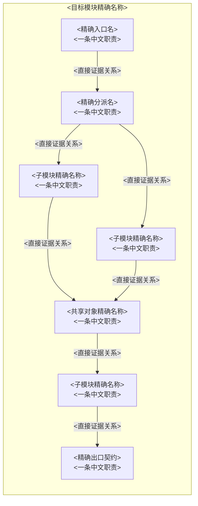

# 07 Diagram Planning and Splitting Rules

For `SBDD_RULESET_REVISION=2026-07-source-semantic-v122`, the render tool's `wordFitStatus=readable` and `documentReady=true` are the only terminal Word-fit acceptance. `split-required` must be replaced by the exact deterministic focused-child groups returned in `pendingSplitDetails.suggestedChildren` before the next view; each replacement keeps its suggested Diagram ID and names the oldest pending parent in `splitFromDiagramId`, and their visible node/edge union must cover it. While that parent remains pending, the next manifest is repair-only and its ID set exactly equals the latest suggested child set; do not rerun the full batch. The repair result must list the parent in `resolvedSplitDiagramIds`; only the readable child PNG set satisfies the base slot. A split-required intermediate probe is evidence-only and does not become another required parent. The tool's calibrated minimum scale is `0.65`, matching the manual checks below.

## 1. 先计划后画图

窄范围源码调用账本的 canonical 路径是 `02-source-evidence/source-call-ledger.md`。

必须先完成 ScopeRegion 固定点探索、DiscoverySurface/Hit/Signal、候选子模块、DesignUnit 双射、FsmAudit、complexity source 闭环，以及目标模块和全部确认子模块的十四项内容草稿与证据表，再生成图形计划。图形必须从已写清的业务流程、代码路径、状态转换和对象生命周期中导出，不能用图形数量替代正文深度；绘图暴露的新缺口必须回写对应内容草稿。发现闭环至少满足 `discoverySignalCount = mappedToCandidateSignalCount + evidencedNonSubmoduleSignalCount`、`unmappedDiscoverySignalCount = 0`、候选 signal ID 双向严格相等和 confirmed Candidate/DesignUnit 双射。不得把一个数组式“图清单”同时当作基础槽位和实际 artifact 账本。

单图或窄范围架构任务也必须先冻结一个有证据的 architecture-unit census，但采用有界探索：先列出目标目录内实际构建的实现编译单元，再用头文件和定点 grep/read 核对公开职责、入口、直接调用与资源所有权；禁止为一张总览全文读取多个大型实现文件。目标的 orchestration/entry/dispatch 实现属于 target 本身，不重复确认为子模块；只有声明、类型、常量或计数器而没有独立实现/API/所有权行为的 header-only 文件不是子模块。现有 `.mmd`、PNG、DOCX 和此前生成的 artifact 不是当前源码证据，不得读取后复制或据此决定 census。要求 `unmappedTargetCompilationUnitCount = 0`、`targetOrchestratorMisclassifiedCount = 0`、`headerOnlySupportMisclassifiedCount = 0`。

单张基础架构图采用固定窄范围取证顺序。从 `03` reference read 起到 terminal review，每个 assistant message 只能有一个 tool call；reference、mkdir、write/edit、source、artifact、validate、render 都不得同消息合并。仅按 `03 → 07 → 08` 加载 reference，禁止 `01` 或其他额外 reference；`extraReferenceReadCount > 0` 立即停止。随后用三个独立消息依次创建目录、写九列 ledger 表头+唯一 sentinel、执行 source call 1。任何合并或换序设置 `multiToolMessageViolationCount > 0`、`STOP_NOW`，整批作废；reference 不增加源码计数。call 1 是精确目标目录 read，其 row 的 `Observed Anchor IDs` 必须字面为 `NONE`；`@dir_listing`、`@file_exists` 或其他无 `:line` 目录伪锚点使 `directoryPseudoAnchorCount > 0`，必须在 call #2 前停止。call 2 是第一次出现的 target-scoped symbol grep 调用；该结果之后只能用 `oldString=sentinel` 追加 ordinal #2，即使结果为空、出错或正则不理想，也禁止替代/更宽/第二次 grep，且不得把两个 grep 合并为一行。要求 `targetSymbolGrepCallCount = 1`、`replacementTargetGrepCount = 0`；call 2 返回前的任何头/实现 read 或返回后的替代 grep 都永久失败。ledger 初始必须含唯一 `<!-- SBDD-APPEND-SOURCE-ROW -->`。每次源码调用返回后，不论零匹配、错误、定位或分页，下一条 tool call 只能独立 edit 该哨兵为“当前真实 ordinal 行 + 原哨兵”；空/失败以 `EMPTY`/`ERROR` 独占 slot。每行 `Observed Anchor IDs` 只能登记该次结果实际显示的 `S<ordinal>A<n>=path:start[-end]@symbol-or-relation`，无行级证据写 `NONE`；目录文件名不能证明关系，grep 不能证明未命中内容。禁止匹配表头/旧行，`oldString` 必须只等于唯一 sentinel；读取账本排错或 bash/shell/write fallback 均失败。edit 失败或成功前续读/grep/其他源码调用均使 `unledgeredSourceCallCount > 0`、永久 `STOP_NOW`。后续只允许固定 slots：`#3 public header → #4 main impl → #5 one confirmed-submodule header → #6 highest-uncovered-relation implementation → #7 frozen-filename build-manifest parent grep → #8 exact caller/egress parent grep(optional)`；不得换序、插入调用或空结果后改宽重试。每个 header row 必须分类；support/definition/platform header、parent read/glob 均禁止。任何 slot 外调用设置 `offSequenceSourceCallCount > 0` 并永久停止。首次 MMD 前独立回读 ledger，从行冻结 `observedSourceAnchorIdSet` 并要求 `unledgeredSourceCallCount = offSequenceSourceCallCount = unobservedLedgerAnchorCount = directoryPseudoAnchorCount = replacementTargetGrepCount = 0`、`targetSymbolGrepCallCount = 1`、`sourceEvidenceCallCount = sourceCallLedgerRowCount = finalSourceCallOrdinal <= 8`、`sourceCallOrderViolationCount = 0`、`fullImplementationReadCount <= 2`、`publicHeaderReadCount <= 1`、`focusedSubmoduleHeaderReadCount <= 1`、`supportDefinitionPlatformHeaderReadCount = parentDirectoryReadCount = parentGlobCount = 0`、`parentScopedGrepCount >= 1 && parentScopedGrepCount <= 2`。漏记、重复 ordinal、错误 header class、虚构锚点或自报计数均失败。最终 confirmed 表只列 frozen set；目标 orchestration 与 excluded/header-only 项只进排除表。要求 `reportedConfirmedSubmoduleCount = reportedConfirmedSubmoduleRowCount = frozenConfirmedSubmoduleNameSet.size`、`reportedConfirmedSubmoduleNameSet = frozenConfirmedSubmoduleNameSet`。

源码阶段开始前建立不可合并的原子 todo；图形项必须逐项写成 `READ source-call-ledger`、`WRITE visible-edge-evidence`、`READ visible-edge-evidence`、`WRITE MMD`、`READ MMD`、`semantic/layout preflight`、`validate`、`render`，不得合并 author/render 或 write/read，只有工具结果返回后才能完成。首次 MMD gate 要求 `multiReadBatchViolationCount = diagramChronologyViolationCount = 0`。可见边、语义节点与布局计划 canonical 路径固定为 `04-diagrams/visible-edge-evidence.md`。工具顺序必须满足 `sourceLedgerReadIndex < semanticLedgerReadIndex < firstMmdWriteIndex < firstMmdReadIndex`；MMD write 早于任一 ledger read 时设置 `diagramChronologyViolationCount > 0`，后补读取或正确文件不能恢复。

该 ledger 在 layout plan 前先冻结 Semantic Node 表：Node ID、Exact evidenced name、Role、DesignUnit/support/egress kind、Observed Anchor ID、direct `path:line`、incident visible Edge IDs。Source ledger 写入时必须冻结可见的节点/接口锚点与 `source -> relationship -> target` 关系锚点；Anchor ID 映射随后永久不可变。每个节点锚点和每条可见边的 Direct Evidence 都必须引用 `observedSourceAnchorIdSet` 中真实存在的 ID，并逐字复用该 ID 对应的路径/行号。节点 anchor 的已记录含义必须直接识别该节点的符号、类型或自有接口，不能拿调用者、相邻文件或不相关函数替代。边 anchor 的已记录含义必须明确包含 `source -> relationship -> target`；只命名一个端点、只证明函数存在、文件存在、include 存在但未登记其依赖语义，或只给出宽泛函数范围，都不能证明该边。不得由相邻代码、行业常识、传递调用或同文件关系外推。后续表格只写裸 Anchor ID，任何 `SxAy=...` 重定义、改行号或改语义均令 `anchorRedefinitionCount > 0`。要求 `unreadEvidencePathCount = unobservedAnchorReferenceCount = anchorSemanticOverreachCount = endpointOnlyEdgeAnchorCount = 0`；任一非零立即停止，禁止写 MMD。允许节点集合只有 target 的真实入口/分派符号、全部 confirmed submodule、满足 support-object 证据规则的对象和一个具名 egress；不得为职责分类、排版、补 rank 或凑复杂度新增泛化节点。`evidencedSupportObjectNameSet` 必须与 Semantic Node 表中 `kind=support` 的精确名称集合相等；不能登记未成图的 support object。要求 `mmdDeclaredNodeIdSet = semanticNodeIdSet`、`architectureBaseConfirmedNameSet = frozenConfirmedSubmoduleNameSet`，且每个 confirmed submodule 的 `incidentVisibleEdgeCount >= 1`；只有 `~~~` 的节点按孤立节点处理。Header-only/excluded 项不得进入 Semantic Node 表。每条 `~~~` 只能写成已声明节点 ID 之间的纯链接，禁止 `A ~~~ NEW["..."]` 形式在布局行创建节点。多 terminal lane 的最终链必须形如 `TERMINAL_A ~~~ TERMINAL_B ~~~ EGRESS`，最右端 token 是 `EGRESS`；`EGRESS ~~~ OTHER` 明确失败。

`04-diagrams/coverage-slots.md` 一行一个基础槽位，列固定为：DesignUnit ID、Candidate ID、DesignUnit、Unit kind、View type、Requirement、Evidence IDs、FSM decision、Base diagram ID、Status。唯一 target module 与每个 target-owned `confirmed_submodule` 形成严格 `5D` 行；所属上级模块不进入该表。

`04-diagrams/diagram-requirements.md` 一行一张实际必需图，列固定为：Diagram ID、Base/focused、Owning slot、Complexity instance IDs、Evidence inputs、Functions/branches/transitions/owners covered、MMD path、Claims path、Source SHA-256、Source status、Syntax validation、Semantic status、Semantic coverage、PNG path、Visible figure ID、Target section、Render disposition、Visual QA status、Word insertion status。其他 reference 引用时不得删减或改写这套 canonical 字段。

设一个 target DesignUnit 与其已确认子模块的设计单元总数为 `D = 1 + confirmedSubmoduleCount`。在写 Mermaid 源码前，账本必须先出现 `5D` 个基础槽位；复杂视图拆出的 overview、branch、error/retry、async、lifecycle、transition 或 handler 图作为附加行关联到对应基础槽位。只有状态机槽位允许证据化 `N/A`。若聚焦详图数为 `F`，必需图数为 `requiredFigureCount = 5D - stateMachineNaCount + focusedFigureCount`；不得仍以 `5D - N/A` 作为含复杂度实例任务的最终图片数。所属上级模块定位图不计入 `D`、`5D` 或 requiredFigureCount。

基础槽位就绪公式固定为 `expectedBaseSlots = 5D - evidencedStateMachineNaCount`。每个非 `N/A` 槽位必须拥有唯一 Diagram ID 和唯一 PNG。Caption-only entries, Mermaid source, ASCII, placeholders, repeated visuals、重复 ID、重复 PNG、共享总图都不计覆盖。分别统计 `unassignedSlotIdCount`、`pendingRenderSlotCount` 和 `missingRenderedPngCount`，不得在只分配 Diagram ID、但仍为 `PENDING` 或没有 PNG 时写成零缺失。证据化状态机 `N/A` 只保留在 CoverageSlot/FsmAudit 账本中并从 `expectedBaseSlots` 排除，不得为它分配 Diagram ID、`.mmd`、PNG、caption、Word image 或任何占位图。目标和全部子模块必须满足 `D = presentStateMachineCount + evidencedStateMachineNaCount + missingStateMachineDecisionCount`，且最后一项为零。只有上述三个计数和 `remainingRequiredFigureCount`、`duplicateDiagramIdCount` 全为零时图形阶段才可终结，否则 Word 状态必须保持 `not_started`。

业务流程图必须额外生成 `04-diagrams/business-flow-plan.md`。表格列：Diagram、Owning design unit、Business level、Flow family IDs、Evidence inputs、Business capabilities/steps/edges covered、Async handoff IDs、Terminal step IDs、Submodules covered、Split reason、Coverage status、Output。它必须与 `14-business-flow-family-census.csv` 双向闭环，满足 `unmappedFlowFamilyCount = 0`、`missingBusinessEdgeCount = 0`、`missingAsyncHandoffCount = 0`、`missingBusinessTerminalCount = 0`。`business-target-module-master-flow` 是 target DesignUnit `business flow` 基础槽位的唯一主图，不得再作为 `5D` 之外的附加图重复计数；另行拆出的流程族、异常、异步、场景或数据状态详图才是附加图。Target 主图不能替代任何 confirmed submodule 的本地业务图，所属上级模块交互图也不能替代 target 主图。

## 2. 图层级

业务流程图层级必须先于代码级详细图规划。业务图和代码图不得混用同一张图表达。

业务图层级：

- B0 business-target-module-master-flow：目标模块 high-level 业务流程图；
- B1 business-submodule-flow：子模块 high-level 业务流程图；
- B2 business-scenario-flow：复杂场景、异常场景、异步等待场景；
- B3 business-data-state-flow：业务对象和业务状态流转图。

代码图层级：

- C0 target-module-code-flow；
- C1 entry-to-main-code-flow；
- C2 submodule-code-detail-flow；
- C3 function-detail-flow；
- C4 fsm-state-overview；
- C5 fsm-transition-conditions；
- C6 error-retry-timeout-code-flow；
- C7 dependency-data-code-flow。

兼容旧 artifact 名称时，可将 `parent-module-*` 视为历史文件名，但其语义所有者必须是当前 target module，不能因此把所属上级模块升格为 DesignUnit。其他兼容层级为：L1 entry-to-main-flow，L2 submodule-business-flow，L3 function-detail-flow，L4 fsm-state-overview，L5 fsm-transition-conditions，L6 error-retry-timeout-flow，L7 dependency-data-flow。

## 3. 拆图判定

不使用节点数、边数或 subgraph 数量作为机械质量指标。该规则只约束单图复杂度和拆图深度，不得用于减少 `5D` 基础槽位。出现以下任一版面情况时拆图：在 Word 正文宽度下标签不可读；主路径和异常/重试/异步分支互相遮挡；架构边界与函数内部控制流混在一张图；状态转换 guard/action 无法完整标注；数据生命周期与业务动作难以同时追踪。

首次渲染前先做布局预演：保留冻结语义 ID 和名称，把每个基础节点固定为“精确名称 ` ` 一条简洁中文职责”两行；源码路径、行号、函数/字段/状态清单、结构布局、容量、阈值、签名、参数和诊断计数器进入图注、证据表或 focused 图。基础架构总览使用 `flowchart TB`、单行 target container 和 `direction TB`。外层容器包含目标自有 entry、真实 dispatcher/handoff、全部 confirmed submodule、经证据确认的 support objects 和一个具名 egress。Support object 只能是目标自有、被至少两个 DesignUnit 共同读写/协调，或主 handoff 不可缺少的数据、资源、队列、缓存、所有权或生命周期对象；它不计入 DesignUnit census，但必须冻结 `evidencedSupportObjectNameSet`。禁止内部 subgraph。可使用最少的 `~~~` 约束版面，但它们不是证据。可见边只保留直接证据支持的主要调用、控制、数据、资源或生命周期关系；每个 confirmed submodule 与 support object 都有真实可见边并处于可追踪的入口—出口骨架。所属上级模块和外部节点只进入 focused interaction 图。渲染前要求 `baseTargetContainerCount = baseNamedEgressCount = 1`，`baseInternalSubgraphCount = baseNodeThirdLineCount = baseNodeCapacityOrParameterCount = directFanoutDuplicateEdgeCount = baseCrossBoundaryEdgeCount = baseExternalNodeCount = baseForeignNodeInsideTargetCount = blankContainerTitleCount = containerEndpointCount = boundaryTitleCrossingRiskCount = shortLinkRedundantLabelCount = edgeLabelOverlapRiskCount = inventedDiagramAliasCount = duplicateConfirmedUnitPlacementCount = postTargetEndNodeOrEdgeCount = orphanConfirmedUnitCount = unmappedBaseSupportObjectCount = 0`，并要求 `baseEgressContractNameSet = evidencedExternalContractNameSet`、`architectureBaseConfirmedNameSet = frozenConfirmedSubmoduleNameSet`、`architectureBaseSupportObjectNameSet = evidencedSupportObjectNameSet`。在 authoring 前以两到三条紧凑纵向 lane 预估 Word-fit；不得通过删除 evidence-backed node/edge、缩短到丢失关系语义或把细节移出基础图来过 `0.65`。第四次 render 返回后必须 `STOP_NOW`；高 DPI 或 `scale=4` 不能掩盖 Word 展示缩小。

### 3.1 首次成图覆盖规则

基础架构图采用可回读的 MMD hard gate：每一条可见箭头行都必须写成带简洁语义标签的 `-->|<evidenced relation>|`（或等价带标签可见箭头）并拥有一条 `VisibleEdgeEvidence`；不得用无标签箭头或反转关系来排版。存在两个或更多 terminal lanes 时，实际 MMD 必须出现一条从最后内部 terminal 到具名 egress 的 `LAST ~~~ EGRESS` 等价 layout-only 行。独立回读后缺少任一 literal condition 时，禁止调用 `validate_mermaid_diagram` 和 `render_mermaid_diagram`；不能先渲染再靠第二次修正补 hard gate。

本小节是基础架构图的最终规则，取代其他位置的旧布局表述。为适配纵向 Word 页，使用 `flowchart TB`，唯一 target boundary 内使用 `direction TB`，形成“单一边界入口 → 真实 dispatcher/handoff → 按真实主依赖分层的全部 confirmed submodule → 单一具名 egress”。基础架构图不得嵌套内部 subgraph；预计同层扇出过宽时，先删除 transitive/secondary duplicate edges，再用已确认节点之间最少的 `~~~` layout-only link 平衡宽高。Invisible links 必须形成不分叉的链或互不共享起点的独立约束，禁止 `A ~~~ B` 与 `A ~~~ C` 这种 invisible fanout；它们单独记入 `layoutOnlyInvisibleLinkIds`，不算源码关系或语义覆盖。不得为布局虚构可见调用、依赖或功能节点。每个 confirmed submodule 必须至少具有一条真实可见 dependency/handoff 边，不得孤立；最外层 target `end` 之后不得再声明任何节点或边，容器 ID 绝不得作为箭头端点。

第一次 authoring 就按 Word 纵向版面规划：target 标题只写动态模块名称和职责，不写源码路径；每个视觉 rank 最多并列三个紧凑节点，节点较多时按真实主依赖形成两到三条纵向 lane，并用不分叉的 `~~~` chain 或互不共享起点的独立约束安排次序。`visible-edge-evidence.md` 还必须包含 layout plan 表：Visual rank、Node IDs、Count、Lane、Terminal。语义节点总数为 7–12 时 `plannedVisualRankCount` 必须为 3–5；6 个稀疏 rank 即使每 rank 不超过三个节点也立即 `STOP_NOW`。独立回读实际 MMD 后按 Mermaid 依赖和 `~~~` 重建 rank，不接受自报；要求 `actualVisualRankPlan = plannedVisualRankPlan`、`maxBaseNodesPerVisualRank <= 3`、`targetTitlePathCount = 0`，并在 7–12 节点时要求 `3 <= actualVisualRankCount <= 5`。同一文件中每条计划可见边一行，字段固定为 Edge ID、Source、Target、Direction semantics、Relationship kind、Displayed label、Observed Anchor ID(s)、Direct evidence `path:line`、Evidence symbol；文件必须以独立 `read` 回读，要求 `edgeEvidenceLedgerWritten = edgeEvidenceLedgerRead = true`。该文件只允许一次 WRITE 后一次 READ；READ 后再 edit/rewrite 令 `edgeLedgerMutationAfterReadCount > 0` 并禁止 MMD。Observed Anchor ID(s) 单元格只能含裸 ID；一个直接关系 ID，或同一精确对象的 producer/consumer 两个接口 ID。每个 ID 和对应路径/行号必须存在于 source-call ledger；仅有目录文件名、未命中符号、相邻代码或最终回答中的计数不算关系证据。可见边方向必须与调用、依赖、数据、资源、所有权或控制传递语义一致，不得为了排版反转关系。写入并独立回读 MMD 后，从实际可见边逐行重建 `(source,target,label)` triples，与账本做双向精确集合比较；要求 `visibleEdgeTripleSet = ledgerEdgeTripleSet`、`visibleEdgeLineCount = visibleEdgeEvidenceRowCount`、`reversedVisibleEdgeForLayoutCount = unmappedVisibleEdgeCount = layoutOnlyVisibleEdgeCount = inventedVisibleEdgeCount = 0`。只为压窄图添加的关系必须是登记过的 `~~~`。

对每个有三个或更多真实可见目标的 source，保留全部证据边，但在首次 render 前用这些目标之间最少的、不分叉且不产生环的 `~~~` chain 把额外目标串到后续视觉 rank；不得让三个目标默认并排后再寄希望于第二次修正。有两个或更多 terminal lanes 时，无条件让最后一个内部 terminal 通过 layout-only `~~~` chain 结束于 egress；不能凭模型预测“egress 应该不会漂浮”而省略。逐行登记实际 `layoutOnlyInvisibleLinkIds`，要求 `layoutOnlyInvisibleLinkCount = layoutOnlyInvisibleLinkIds.size`，禁止把存在的 `~~~` 报告为零。中文职责短语保持完整但紧凑，嵌入的英文缩写与中文之间不留无意义空格。要求 `egressTerminalVisualRank = true`、`unresolvedWideFanoutSourceCount = wastefulBaseLabelWhitespaceCount = 0`；layout-only links 不得进入 `VisibleEdgeEvidence` 或语义覆盖。

所有必需基础图使用 Render Service 白色默认主题，禁止 init/theme directive、`classDef`、`class`、`style` 和 `linkStyle`。每个基础图节点只包含精确名称、一个简洁中文职责短语，最多一个源码锚点；函数/字段/状态清单、结构布局、容量、阈值、签名、参数、诊断计数器和说明段落必须进入 focused 图、图注、证据表或正文。详细度由完整语义节点集合和可追踪的依赖、分支、转换、交接、异常恢复及生命周期边提供，不由长标签提供。首次验证前发现任一禁用样式 token 或清单型节点时，保持 `semantic_validated=false`，不调用 renderer。

基础架构图必须从下列结构骨架实例化，把所有尖括号占位替换为当前源码事实，并按 census 扩展 `UNIT_*`、主要依赖边和必要的 layout-only links；不得把占位文字复制到交付图中：

写入 `.mmd` 后必须先用一次独立 `read` 回读，再从实际行重建可见边 triples 和 `layoutOnlyInvisibleLinkIds`；write 返回、自述或内存中的 source 不能替代回读。预检要求 `baseTargetContainerCount = 1`、`baseInternalSubgraphCount = baseNodeThirdLineCount = baseNodeCapacityOrParameterCount = directFanoutDuplicateEdgeCount = layoutOnlyInvisibleFanoutCount = targetTitlePathCount = reversedVisibleEdgeForLayoutCount = unmappedVisibleEdgeCount = layoutOnlyVisibleEdgeCount = inventedVisibleEdgeCount = unresolvedWideFanoutSourceCount = wastefulBaseLabelWhitespaceCount = postTargetEndNodeOrEdgeCount = containerEndpointCount = orphanConfirmedUnitCount = duplicateConfirmedUnitPlacementCount = targetOrchestratorMisclassifiedCount = headerOnlySupportMisclassifiedCount = unmappedBaseSupportObjectCount = 0`；同时 `edgeEvidenceLedgerWritten = edgeEvidenceLedgerRead = true`、`visibleEdgeTripleSet = ledgerEdgeTripleSet`、`visibleEdgeLineCount = visibleEdgeEvidenceRowCount`、`layoutOnlyInvisibleLinkCount = layoutOnlyInvisibleLinkIds.size`、`maxBaseNodesPerVisualRank <= 3`、`egressInsideTarget = egressTerminalVisualRank = true`、`architectureBaseConfirmedNameSet = frozenConfirmedSubmoduleNameSet`、`architectureBaseSupportObjectNameSet = evidencedSupportObjectNameSet`。任一字段缺失或不成立都不得 validate 或 render。

每次 renderer 返回后，在复制、hash、声明、完成提示或下一次 MMD 写入前，把返回的 `width`、`height` 代入并明确写出 `widthFit = 624 / width`、`heightFit = 720 / height`、`wordFitScale = min(1, widthFit, heightFit)`。该门禁适用于完整 Word、无 Word、image-only、窄范围和校准任务；不得以“不生成 Word”豁免。缺少三步算式、使用 pixelWidth/pixelHeight、舍入后虚增到阈值或结果低于 `0.65` 都是失败。把原始值、算式、`firstPass`、terminal disposition 和精确返回路径写入 review/checkpoint 并独立回读；仅有 `rendered: true`、无 diagnostics、较高 DPI 或合格裁剪不得宣称完成。修正尝试必须重新执行 MMD write → 独立 read → triples/layout/literal hard-gate → validate → render，禁止跳过修正版回读。

以下语义复杂度不依赖版面拥挤。先从全部 entry、BF、CE、BR、ST、ownership/lifecycle 和 platform/feature/build/init evidence ledgers 反向导出 `04-diagrams/complexity-sources.md`，逐条记录 ComplexitySourceId、Source kind、DesignUnit ID、Origin evidence IDs、Disposition、Instance ID 和 Disposition evidence IDs。Disposition 只能是 `focused_instance`、`base_view_only` 或 `evidenced_non_instance`；后两者必须使用限定理由和证据。要求 `complexitySourceCount = mappedToInstanceCount + evidencedBaseViewOnlyCount + evidencedNonInstanceCount` 且 `unmappedComplexitySourceCount = 0`。

再生成 `04-diagrams/complexity-census.md`，逐实例记录 Signal ID、DesignUnit ID、Kind、ComplexitySourceIds、Evidence IDs、Required view/figure kind、Diagram IDs、MergeGroupId、Merge reason、edge/transition/owner/variant coverage、Status。不得只按类别写一个泛化 signal，也不得只有 merge reason 而没有 diagram ID：

- 多入口（multi-entry）或多个独立业务流程族：每个入口/流程族各有实例，保留本地 overview，并生成业务流程详图；
- 异步等待、回调、超时或取消链：生成 async detail；
- 独立错误、重试、恢复或回滚链：生成 exception/recovery detail；
- 多个独立 FSM 域：每个域生成 state overview 和 transition detail；普通非状态 dispatch 域逐实例生成 code-flow dispatch detail，不当作状态机；
- 多个独立数据/资源所有权或生命周期族：生成对应 lifecycle detail；
- 实质不同的平台、feature flag、构建注册或初始化变体：生成 architecture 或 code-flow variant detail。

多个实例共图时必须具有相同 DesignUnit、view 和 figure kind，共享 MergeGroupId，并逐实例证明语义覆盖和可读性；跨 DesignUnit/基础槽位共图禁止。`focusedFigureCount` 按唯一 focused diagram ID 计算，且 base/focused diagram ID 集合不得相交。

拆图后保留 source-backed overview，并按 flow-family census 补充业务族、error/retry、async/wait、data/state 或对应子模块详图。Overview 不是目录图：架构总览必须逐名展示全部 confirmed submodule、经证据冻结的 support objects、边界、职责和依赖方向；业务与代码总览必须保留全部 flow family、dispatch branch、async/wait handoff、error/recovery route 和 terminal 导航边；生命周期总览必须展示主要对象及 create/init、ownership、reader/writer、transfer、invalidation、release。用 phase name、数量或聚合占位代替这些语义时，base slot 为 `MISSING`。架构总览只保留一个目标 entry、一个真实 dispatcher/handoff、全部 confirmed submodule、全部 frozen support objects 和一个具名 egress；并列入口、外部调用方、poll/reset、回调、签名、容量和阈值进入图注、接口表或 focused 图。容器内用真实依赖形成纵向层次，不新增职责分类节点或虚假执行边。架构基础图必须满足 `architectureBaseConfirmedNameSet = frozenConfirmedSubmoduleNameSet` 和 `architectureBaseSupportObjectNameSet = evidencedSupportObjectNameSet`；其他非 DesignUnit 内部组件只能进入聚焦图，且不得替换 confirmed submodule 或 support object。其他基础图分别与 flow/edge/terminal、entry/branch/handoff/error、object/owner/phase 集合双向比对，要求 `missingOverviewSemanticItemCount = foreignOverviewSubstitutionCount = 0`。不得用代表性流程、删异常路径或无限缩小维持单图；第二次仅可修正布局，不能删语义。

### 3.2 首次布局预算

7–12 个基础节点强制安排 3–5 个 visual ranks，`plannedVisualRankCount > 5` 或 `< 3` 时禁止写 MMD，不是可忽略的建议；无论节点数多少，首次计划都必须估算 `estimatedCssWidth <= 960`、`estimatedCssHeight <= 1107`，不能用六个稀疏 singleton/pair ranks 代替 Word-fit 规划。估算只约束布局，不得删减 semantic node/edge set；无法同时容纳时保留完整可导航 overview 并增加 focused 图。

## 4. 模块与子模块五视图

请求解析后的 target module 和每个已确认子模块都必须规划 architecture、business flow、code flow、state machine、data/lifecycle 五类视图。重要性不决定是否进入覆盖账本；复杂度实例决定必须增加哪些聚焦详图。Target 和子模块使用相同的 `PRESENT | N/A | MISSING` FSM audit：只有持久控制状态参与 `current state -> event/trigger -> guard/action -> next state` 关系时才要求状态机图；只有完整 absence audit 才能标记 `N/A`；证据不足必须是 `MISSING`。普通 opcode/command/type 分派、handler table、普通 switch selector、结果/status 字段或数据/资源生命周期本身不是状态机证据，应进入相应 code/lifecycle complexity source，而不是虚构状态。所属上级模块不在五视图矩阵中；需要时只能生成额外的定位或交互图。

五张基础图本身必须分别成为该 DesignUnit 的详细语义地图，不能只是章节目录、组件清单、阶段名称、单一路径或几个泛化方框。架构基础图直接呈现边界、真实入口/分发/出口、全部确认子模块、各自职责、主要内部依赖和共享对象/资源/适配契约；业务基础图直接呈现全部适用流程族、业务决策、跨单元/异步 handoff、等待/重试、异常恢复、清理和终态；代码基础图直接呈现真实入口函数、关键调用、条件/循环、回调、数据或状态写入、错误返回和清理；状态机基础图直接呈现状态、事件、guard、action、next state、非法/忽略事件以及失败恢复；数据/生命周期基础图直接呈现对象创建初始化、所有者、读写者、跨层传递、并发/持久化、失效、回收和释放。只要源码存在适用语义而基础图没有直接显示，对应基础槽位就是 `MISSING`；不能用“详见正文”或 focused 图补救一个简单空壳基础图。图过密时必须保留能导航全部语义的详细总览，再按分支、异常、状态簇、调用族或对象族增加 focused 图；拆图只能增加细节，不能从基础图删除适用流程族、关键决策、异常/恢复、状态或生命周期导航。

每个非 `N/A` 基础槽位至少需要一张唯一主图。一张 PNG、一个 Mermaid source 或一个 diagram ID 只能归属一个设计单元的一种基础视图；跨模块总图、共享依赖图、所属上级模块定位图和聚合图是附加图，不能为多个基础槽位重复计数。根会话只处理当前冻结批次，并按 DesignUnit 顺序逐单元、逐槽位串行执行。每个槽位依次经过 `planned -> authored -> source_label_audited -> syntax_validated -> semantic_validated -> render_mermaid_diagram -> render_diagnostics_validated -> word_fit_validated -> attempted_success`，或以真实 blocker evidence 结束为 `MISSING`。根会话更新唯一 result/ledger 并聚合 `completedFigureUnitIds`、`requiredFigureCount`、`uniqueSuccessfulDiagramIdCount` 和 `remainingRequiredFigureCount`；缺失任何单元时不得合并 Word。单个 DesignUnit 完成不是用户响应边界；只有当前冻结批次全部通过后才请求一次“继续”。`save_mermaid_artifact` 只保存 source，不得代替渲染状态。初始失败后最多允许三次有诊断依据的布局修正；第四次失败保存当前 Diagram ID、诊断和 blocker，下一轮只恢复该槽位。

每张必需图必须有 terminal disposition：`semantic_validated -> attempted_success | attempted_failed`；`MISSING -> not_attemptable + blockerEvidenceIds`。禁止在同一模型响应或未记录前一结果时发出第二个 `render_mermaid_diagram`。每次先等待结果并计算全部门禁；只有合格结果才复制到 terminal 路径、计算 terminal SHA-256、核对 source/Diagram ID 并更新成功账本。硬不变量为 `renderAttemptCount <= 4`。调用前读取持久化计数并执行硬状态表：`renderAttemptCount=0` 才可初始渲染；`1 <= renderAttemptCount < 4` 且有明确诊断才可修正渲染；`renderAttemptCount=4` 必须 `STOP_NOW`。第四次仍不满足 semantic/service/Word-fit/identity 时必须 `attempted_failed`，只允许更新 review/resume；不得复制到 terminal PNG、声明 artifact、发完成建议、交付文件、再 write MMD、validate 或 render，也不得以“当前任务不生成 Word”改判。只有独立结果明确 `rendered: true`、PNG 非空、无 error、尺寸/scale/crop/content ratio/density/Word-fit 全部成立，且当前 artifact path、PNG path 和 SHA-256 未被其他 terminal Diagram ID 使用，才可 `attempted_success`。要求 `uniqueSuccessfulDiagramIdCount = attemptedSuccessCount = uniqueTerminalArtifactPathCount = uniqueTerminalPngPathCount = uniqueTerminalPngSha256Count = requiredFigureCount`，`duplicateTerminalPngHashCount = renderOutputPathCollisionCount = 0`。重试另记 diagnostics，每个 ID 最终只绑定一个当前 PNG；复制、旧路径、覆盖结果或跨 ID 字节相同均失败。还必须满足剩余、失败、不可尝试计数为零；此前 Word 保持 `not_started`。

渲染次数按工具调用计数，不按成功 PNG 计数：`0 -> 允许首次 render`；`1..3 + 明确诊断 -> 允许定点修正 render`；`4 -> STOP_NOW`。远端语法失败也消耗一次。第四次仍失败时不得继续 write/validate/render；不得通过改名规避计数。

## 5. 有效代码级流程图

代码级流程图必须覆盖源码中实际存在的 decision、branch label、switch/case、loop、condition 下调用、state/data read/write、return、error、wait/retry、complete 和 evidence mapping。不存在的结构记录为不适用，不通过虚构分支或节点满足数量要求。

本条适用于代码级详细业务/逻辑图。high-level 业务流程图的有效性以第 6 节为准。

## 6. high-level 业务流程图有效性

high-level 业务流程图必须覆盖真实存在且适用的以下语义：

- 外部业务触发；
- 业务输入对象；
- 子模块业务动作；
- 业务条件边；
- 业务状态或数据影响；
- 下游依赖或异步等待；
- 错误/重试/终止路径；
- 成功完成路径；
- BF edge coverage。

high-level 业务流程图不得以函数名作为主流程节点，不得只有组件拓扑，不得只画 happy path。

Target high-level 主图还必须满足：它表达从全部外部触发到全部业务终态的端到端闭环；所有 flow family 在图中可见或可导航到唯一聚焦图；影响业务结果的决策边、跨单元/异步 handoff、失败/恢复/清理边和终态均有 Diagram ID 覆盖。单个子流程、状态机或组件关系图不能替代主图。完整性按 `14-business-flow-family-census.csv` 和 business-flow-plan 的集合覆盖判定，不按节点数量判定。
